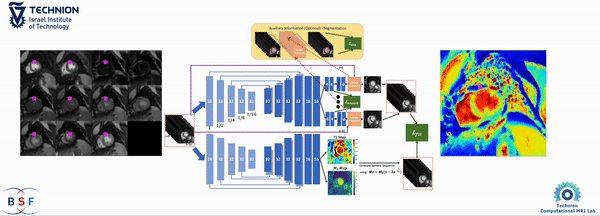

# Welcome to the Official Repository of PCMC-T1.
## [PCMC-T1: Free-breathing Myocardial T1 Mapping with Physically-Constrained Motion Correction](https://arxiv.org/abs/2308.11281), MICCAI 2023

# 📢 New Paper Announcement!  

We are excited to share our latest research:  

## 📝 **MBSS-T1: Model-Based Self-Supervised Motion Correction for Robust Cardiac T1 Mapping**  

✅ **Accepted in the Medical Image Analysis Journal** – Publication coming soon!  

This paper introduces a **motion correction method for T1 mapping** that eliminates the need for model training. It is **compatible with any MRI scanner and protocol**, making robust T1 mapping more accessible.  

### 🚀 Code Release  
Expected in **Early to Mid-February** – Stay tuned!  

🔗 **Read the preprint:** [arXiv:2408.11992](https://arxiv.org/pdf/2408.11992)  


## What is PCMC-T1?
$T_1$ mapping is a quantitative magnetic resonance imaging (qMRI) technique that has emerged as a valuable tool in the diagnosis of diffuse myocardial diseases.
However, prevailing approaches have relied heavily on breath-hold sequences to eliminate respiratory motion artifacts. This limitation hinders accessibility and effectiveness for patients who cannot tolerate breath-holding. Image registration can be used to enable free-breathing $T_1$ mapping. Yet, inherent intensity differences between the different time points make the registration task challenging. 
We introduce PCMC-T1, a physically-constrained deep-learning model for motion correction in free-breathing $T_1$ mapping. We incorporate the signal decay model into the network architecture to encourage physically-plausible deformations along the longitudinal relaxation axis. 



If you use PCMC-T1 in your research, please cite the [paper](https://arxiv.org/abs/2308.11281) as follows:

```
E. Hanania, I. Volovik, L. Barkat, I. Cohen, and M. Freiman, PCMC-T1: Free-Breathing Myocardial T1 Mapping with
Physically Constrained Motion Correction, Proc. 26th International Conference on Medical Image Computing and
Computer Assisted Intervention, MICCAI 2023, Vancouver, Canada, Oct. 8-12, 2023.
```

## Installation

To use this project, follow these steps:

1. **Clone the Repository:**
   ```sh
   git clone https://github.com/eyalhana/PCMC-T1.git
2. **Install Dependecies**
   ```sh
   pip install -r requirements.txt

## Dataset 
We utilized a publicly available myocardial T1 mapping [dataset](https://pubmed.ncbi.nlm.nih.gov/29314198/). To use this dataset, please download it in '.mat' format:
Use `wget` (Linux/macOS) or `curl` (Windows/Linux/macOS) to download the file:
   - On Linux/macOS, use `wget`:
     ```sh
     wget -O data/T1Dataset210.mat [https://dataverse.harvard.edu/api/access/datafile/43188520](https://dataverse.harvard.edu/file.xhtml?persistentId=doi:10.7910/DVN/DHEUAV/H5WVDS)
     ```
   - On Windows/Linux/macOS, use `curl`:
     ```sh
     curl -o data/T1Dataset210.mat [https://dataverse.harvard.edu/api/access/datafile/43188520](https://dataverse.harvard.edu/file.xhtml?persistentId=doi:10.7910/DVN/DHEUAV/H5WVDS)
     ```
## Usage instructions
### Training
To train using the **MICCAI 2023** configuration (physically-constrained motion correction):
``` sh
python /scripts/training.py --config /configs/miccai.yaml --fold 1
```
To train using the **ISMRM 2023** configuration (group-wise mutual-information based motion correction):
``` sh
python /scripts/training.py --config /configs/ismrm.yaml --fold 1
```
You can customize hyperparameters and file paths in the configuration files.


#### Customizing Data Loading

If you intend to train your own model using custom datasets or data formats, you'll likely need to customize the data-loading code in the following project files:

- `src/generators.py`
- `src/data_preprocessing.py`
- `config_loader.py`


### Testing
We used the $R^2$ of the model fit to the observed data in the myocardium, the Dice score, and Hausdorff distance values of the myocardium segmentations as the evaluation metrics. To assess the quality of a model by computing these metrics, run:

``` sh
python /scripts/evaluation.py --config configs/miccai.yaml --model models/model_name.pt
```

# Contact
For any code-related problems or questions please [open an issue](https://github.com/eyalhana/PCMC-T1/issues).
For other inquiries, please contact us via email at ```eyalhan at campus.technion.ac.il```.
